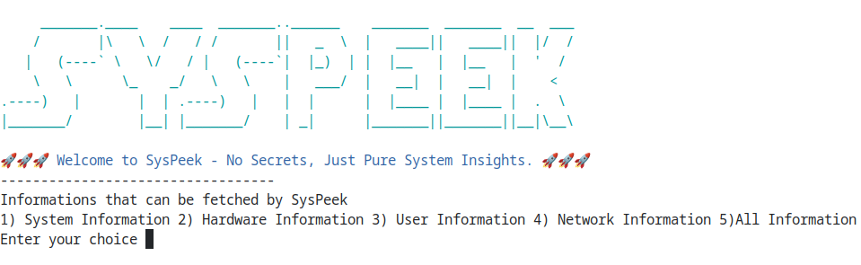

# SysPeek
>⚠️**Note:** Please do not share your network information with individuals who may be threat actors or pose a potential security risk.
---
## Table of Contents
1. [Description](#description)
2. [Features](#features)
3. [Installation](#installation)
4. [How to use](#how-to-use)
5. [Screenshots]
6. [License]
7. [Contributions]
--- 

## Description
SysPeek is an interactive, menu-based information-fetching tool made in Bash that retrieves various details from your Linux distribution — such as System, Hardware, User, and Network information — and showcases them based on your choices.
It is highly modular, with each function defined specifically for clarity and maintainability. SysPeek is lightweight, works completely offline, and is fully open-source.

---
## Features
- 🎛️**Menu-based interface**&nbsp;&nbsp;(choose what info to display)
- 🧩 **Modular design**&nbsp;&nbsp;(separate functions for each info type)
- 🚫 **Fully offline**&nbsp;&nbsp;(works without internet)
- ⚙️ **User-driven output**&nbsp;&nbsp;(pick specific sections or all)
- 🌐 **Network info**&nbsp;&nbsp;(IPv4, IPv6 fallback, SSID, gateway)
- 🧠 **Extra details**&nbsp;&nbsp;(last login, swap, shell version, groups)
- 🎨 **Color-coded output**&nbsp;&nbsp;(terminal-friendly output)
- 🪶 **Lightweight & Bash-only**&nbsp;&nbsp;(no external dependencies)
---

## Installation 

SysPeek can be installed in two simple ways:
* ### Method 1: using `wget`
```bash
wget https://raw.githubusercontent.com/deepak-kushwaha18/SysPeek/main/SysPeek.sh
```
Make the script executable:
```bash
chmod +x SysPeek.sh
```
* ### Method 2: clone the github repo
```bash
git clone https://github.com/deepak-kushwaha18/SysPeek.git
```
Navigate to SysPeek directory:
```bash
cd SysPeek/
```
Make the script executable:
```bash
chmod +x SysPeek.sh
```
---

##  How to use
After making the script executable, you can run it using the following command:
```bash
./SysPeek.sh
```
### Run SysPeek from anywhere
If you like to run the script from anywhere on your system, move it to `/usr/local/bin`:
```bash
Sudo mv SysPeek.sh /usr/local/bin/syspeek
```
then just type following command from anywhere in your system from terminal to use the tool:
```bash
syspeek
```
---

## Screenshots
* ### Main Menu
  
* ### System Information
  
* ### Hardware Information
  
* ### User Information
  
* ### Network Information
  
  
 > ⚠️ **Note:** Sensitive information like **usernames**, **hostnames**, and **IP addresses** has been **blurred** in the screenshots for **privacy and security reasons**.
---

## License
This project is licensed under the [MIT License](LICENSE).
